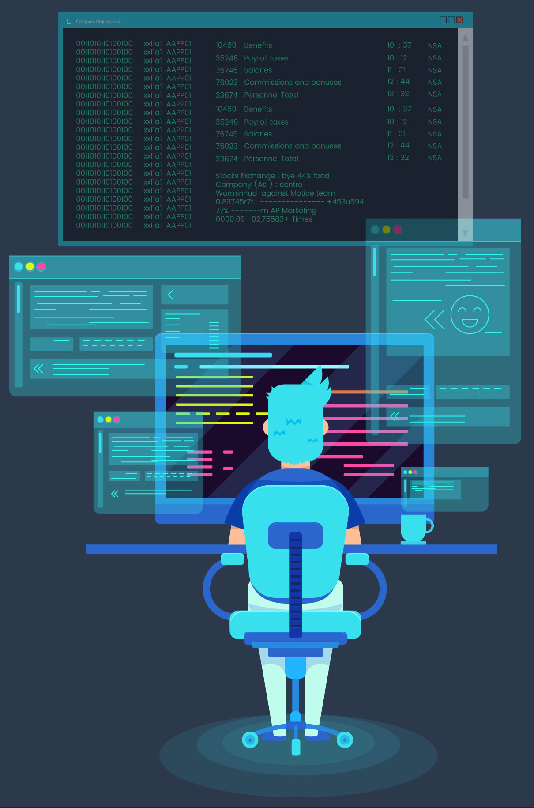

<!--START_SECTION:header_gif-->

  

<!--END_SECTION:header_gif-->

  

---

## :zap: About Me 👋

<!--START_SECTION:about_me-->
- 🔭 &emsp; I’m currently exploring the depths of Programming
- 🌱 &emsp; I’m currently learning Competitive Programming
- 💬 &emsp; Ask me about anything🤫, `sky's the limit`
- 📫 &emsp; How to reach me: 
&emsp;
 
&emsp;

&emsp;

<!--- 👯 I’m looking to collaborate on ...-->
<!--END_SECTION:about_me-->

  

---

<h2 align="center"> :zap: My Tech Toolbox 🛠  </h2>

<!--START_SECTION:my_tech_toolbox-->

  
  <pre>🖥  Programming Languages </pre>
  &emsp;&emsp;&emsp;
  <code></code>
  &emsp;&emsp;&emsp;
  <code></code>
  &emsp;&emsp;&emsp;
  <code></code>
  &emsp;&emsp;&emsp;
  <code></code> 

  <pre>🚀  Machine Learning </pre>
  &emsp;&emsp;&emsp;
  <code></code>
  &emsp;&emsp;&emsp;
  <code></code>
  &emsp;&emsp;&emsp;
  <code></code>

  <pre>🌎 Web Development </pre>
  &emsp;
  <code></code>
  &emsp;&emsp;
  <code></code> 
  &emsp;&emsp;
  <code></code>
  &emsp;&emsp;
  <code></code>
  &emsp;&emsp;
  <code></code> 
  
  <pre>👨🏻‍💻 Development Environment Stack </pre>
  &emsp;&emsp;&emsp;
  <code></code>
  &emsp;&emsp;&emsp;
  <code></code>
  &emsp;&emsp;&emsp;
  <code></code>

<!--END_SECTION:my_tech_toolbox-->

  

---

## :zap: Programming Profiles
 

<!--START_SECTION:programming_profiles-->

  
  &emsp;&emsp;
  
  &emsp;&emsp;
  
  &emsp;&emsp;
  
  &emsp;&emsp;
  
  &emsp;&emsp;
  
  <!--&emsp;&emsp;
  -->

<!--END_SECTION:programming_profiles-->

  

---

## :zap: Github Profile Stats

<!--START_SECTION:github_profile_stats-->

<!--END_SECTION:github_profile_stats-->

---

## :zap: Recent Activity ⌨️

<!--START_SECTION:activity-->

<!--END_SECTION:activity-->

  

---

` This isn't the End, but is just the beginning of a beautiful Journey 🛣  `
